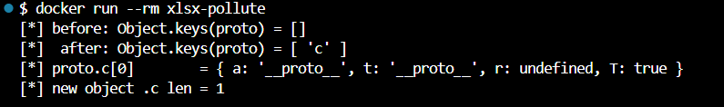

# CVE‑2023‑30533 – SheetJS `xlsx` Prototype‑Pollution PoC

> **Severity:** HIGH (7.8 CVSS v3.1)  
> **Package:** `xlsx` ≤ 0.19.2 (our PoC pins 0.18.5)

This PoC demonstrates Prototype‑Pollution in the SheetJS Community‑Edition when parsing a crafted Excel workbook.  A malicious Threaded‑Comment injects `__proto__` keys, letting an attacker add arbitrary properties to `Object.prototype`.

---
## Environment Details

Base Image: node:18‑slim

Dependencies:

xlsx@0.18.5 – vulnerable version

jszip@3.10.1 – helper to patch XLSX on the fly

Files:

threaded_comment_bad.xlsx – baseline PoC workbook

exploit.js – generates evil workbook in‑memory, triggers parser

---

## Exploit Steps
```bash
# Build & run Docker image
$ docker build -t cve-2023-30533 .
$ docker run --rm cve-2023-30533
```

Expected console:
```bash
[*] before: Object.keys(proto) = []
[*] after: Object.keys(proto) = [ 'c' ]
[*] proto.c[0].a = "__proto__"
```
The baseline PoC attaches the entire threaded comment array to Object.prototype.c.  

## Result Screenshot


---


## Mitigation Notes

Upgrade to SheetJS CE ≥ 0.19.3 (only distributed via SheetJS CDN as of July 2025).

Freeze Prototype: add Object.freeze(Object.prototype); before any untrusted file is parsed.

Sandbox Parsing: move XLSX processing into an isolated worker / container, return serialised JSON.
