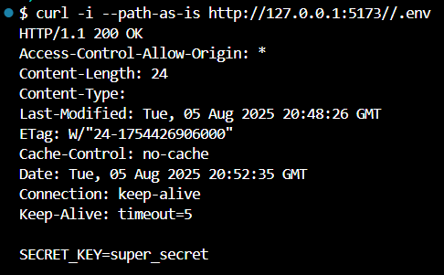
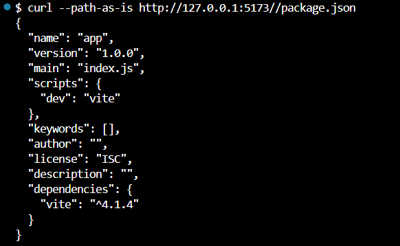

# CVE-2023-34092 – Vite Dev-Server Path-Normalisation Bypass → Arbitrary File Read PoC

> **Severity:** HIGH (7.5 CVSS v3.1)  
> **Package:** `vite` ≤ 4.1.4 (tested 4.1.4)

The development server checks its deny‑list *before* normalising the request path.  
If a request begins with a double slash (`//.env`, `//secret.pem`, etc.), the security filter is skipped and any file in the project root can be read without authentication whenever the server is started with `--host`.

---

## Environment Details

Base Image: node:18-alpine

Dependencies:

vite@4.1.4 (vulnerable)

Minimal static site: `index.html` plus a dummy **.env** secret; server launched with `npm run vite -- --host` so it listens on 0.0.0.0.

## Exploit Steps

Send a GET request to `//.env` on port 5173 using a client that preserves the double slash, e.g.  
`curl -i --path-as-is http://TARGET:5173//.env`

The dev‑server skips the deny‑list and responds with the raw contents of `.env`.

Repeat the request with other filenames (`//cert.pem`, `//package.json`) to exfiltrate additional files.

## Result Screenshot

## Mitigation Notes

Upgrade to **vite ≥ 4.2.0** where the path is normalised before filtering.  

If upgrading is impossible, bind the dev‑server to localhost only, place a reverse‑proxy rule that blocks paths starting with `//`, and move sensitive files outside the project root.
