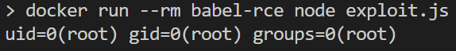

# CVE-2023-45133 – Babel `@babel/traverse` Constant-Folding RCE PoC

> **Severity:** CRITICAL (9.3 CVSS v3.1\*)  
> **Package:** `@babel/traverse ≤ 7.23.1` (**tested 7.21.2**, bundled with `@babel/core 7.21.x`)

`path.evaluate()`/`evaluateTruthy()` execute attacker-controlled AST nodes.  
By abusing `Number.constructor` (alias of `Function`) inside a crafted `toString` property, an attacker achieves **arbitrary code execution at compile-time**.

---

## Environment Details

* **Base image (or host):** node:18-bullseye  
* **Dependencies:**  
  * `@babel/parser@7.23.0`  
  * `@babel/traverse@7.21.2` (vulnerable)  

## Exploit Steps
1. **Build and run the PoC container**
```bash
docker build -t babel-rce .
```
2. **Run exploit**

Once the container is built, run the following command:
```bash
docker run --rm babel-rce node exploit.js
```
## Result Screenshot


## Mitigation Notes
Upgrade to @babel/traverse ≥ 7.23.2 (or @babel/core ≥ 7.23.2).

Until patched, disable plugins that call path.evaluate(), sandbox compilation (Docker/Firejail + seccomp), and run CI workers with least-privilege accounts.
